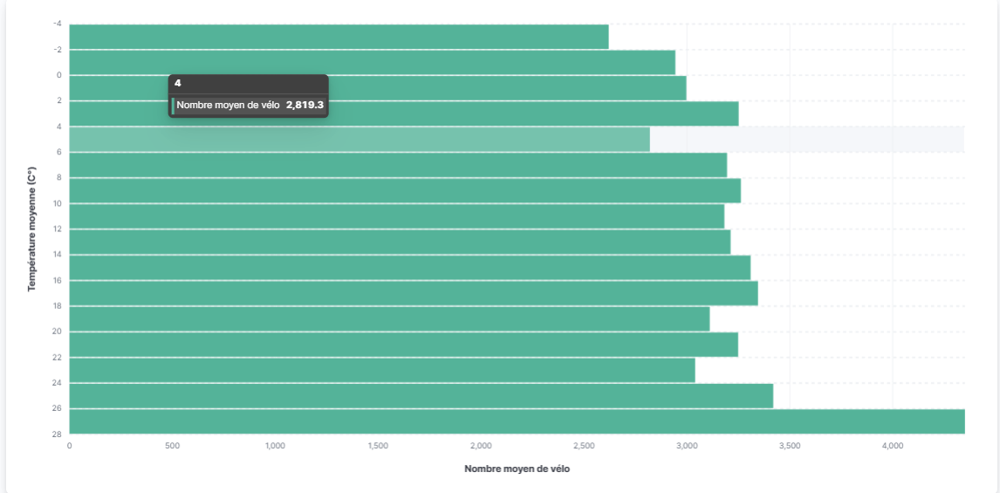
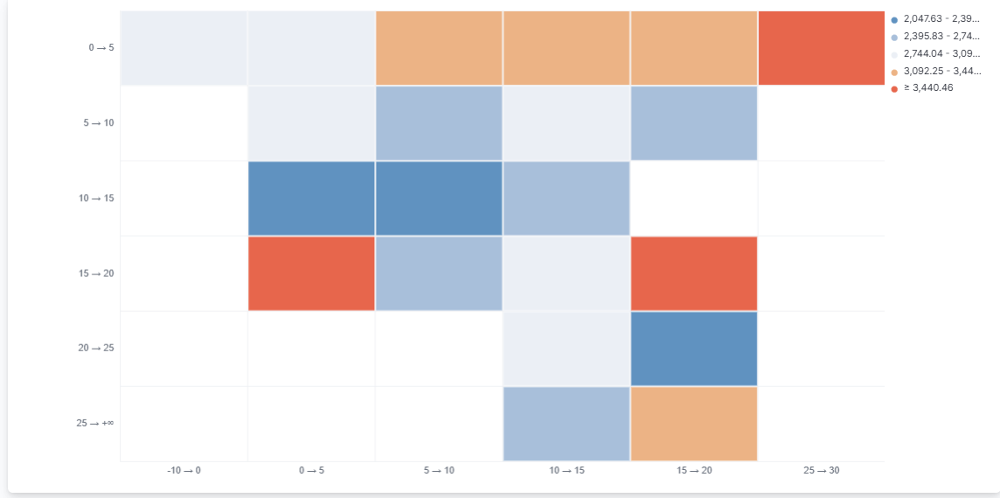

# **Projet d'Analyse de Données : Impact de Facteurs Externes sur une Activité de Mobilité**

## **Description**
Ce projet analyse comment des facteurs externes influencent l'utilisation des vélos. Ici le facteur externe sera la météo avec deux variables : la température et les précipitations

## **Objectifs**
- **Collecte des données** : Extraction via APIs de mobilité et météo.
- **Pré-analyse** : Nettoyage et exploration des données dans Jupyter Notebook.
- **Stockage** : Base PostgreSQL pour les jointures et analyses.
- **Visualisation** : Tableaux de bord interactifs créés avec Kibana.

## **Visualisations Clés**
### Graphique 1 : Température vs Flux de Vélo

### Heatmap : Température/Précipitations vs Mobilité

## **Difficultés rencontrées**
- **Limitations des APIs** : Gestion des quotas.
- **Problèmes de connectivité** : Intégration entre outils.
- **Contraintes de temps** : Travail réalisé seul.
